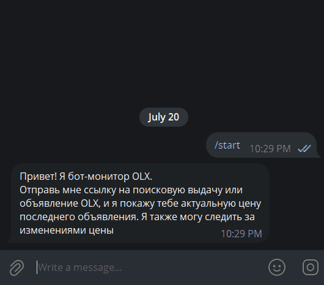
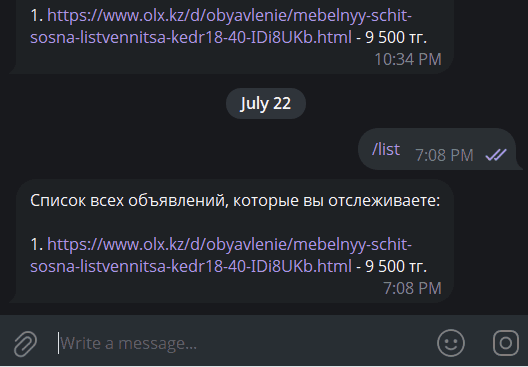

# OLX Price Monitor Telegram Bot

A Telegram bot that monitors OLX.kz listings and sends a notification whenever the price changes.

Built with **Python**, **aiogram 3**, **Playwright**, and **SQLite**. The bot periodically checks tracked listings in the background and supports multiple users.

> **Note:** This project is for educational/personal use, as scraping OLX.kz
> may not align with their Terms of Service. Check current ToS before
> using this for anything beyond personal, low-volume monitoring.

> **Demo Bot**
>
> https://t.me/olx_monitor_temp_bot

---

## Demo

OLX Kazakhstan's primary audience is Russian-speaking, hence the bot's language.

### Add a listing



> user sends an olx link -> bot returns price and starts tracking this link

---

### Price change notification



> listing price changed -> notification with the new price

---

## Features

- Monitor multiple OLX.kz listings
- Automatic price checks every 15 minutes
- Telegram notifications on price changes
- Multi-user support
- SQLite storage
- Dynamic page scraping with Playwright
- Basic anti-bot handling using `playwright-stealth`
- Graceful shutdown
- Per-user tracking limit

---

## Known Limitations

- OLX like any other website may change its markup and bot-detection, so scraping may
  break periodically and require selector/pattern updates.

---

## Commands

| Command                  | Description                 |
| ------------------------ | --------------------------- |
| `/start`                 | Start the bot               |
| `/list`                  | Show tracked listings       |
| `/delete <number>`       | Remove a listing            |
| `https://www.olx.kz/...` | Add a listing to monitoring |

---

## Tech Stack

- Python 3.10+
- uv
- aiogram 3
- Playwright
- playwright-stealth
- aiosqlite (sqlite)
- pytest

---

## Installation

### Prerequisites

- Python 3.10+ (managed via `uv` package manager)

### Project setup

```bash
# 1. Clone the repository
git clone https://github.com/dar-key/appointment-booking-bot.git
cd appointment-booking-bot

# 2. Install dependencies
uv sync

# 3. Install Chromium
uv run playwright install --with-deps chromium

# 4. Copy the environment template and set your values
cp .env.example .env
```

## How to run

### Running locally

```bash
uv run task start
```

### Running with Docker

```bash
docker compose up --build
```

#### Note on data persistence (Docker)

`docker-compose.yml` mounts `./data` to `/app/data` and sets
`DB_NAME=/app/data/database.db`, so the SQLite file survives container
restarts/rebuilds.

---

## Testing

```bash
uv sync
uv run pytest -v
uv run ruff check .
```
